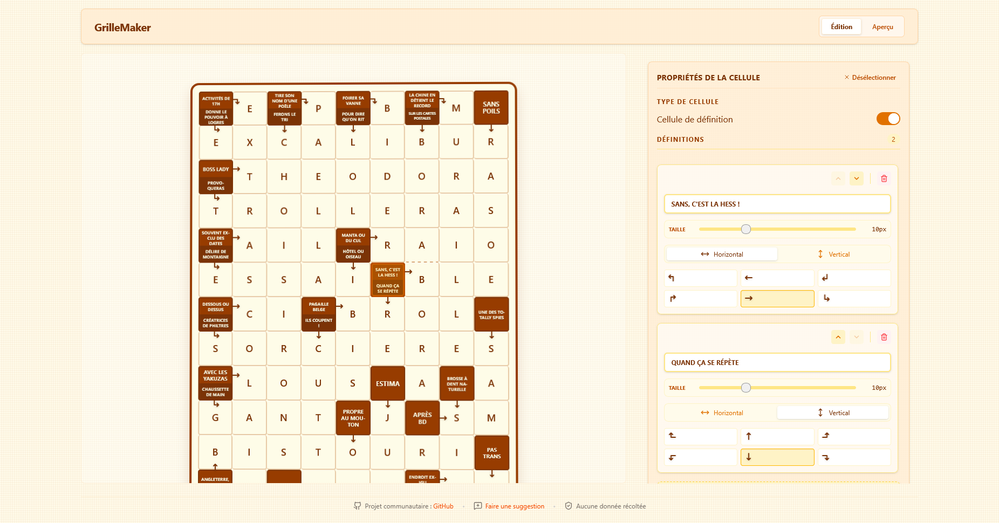

# GrilleMaker 🧩

> 🚀 **Application disponible en ligne :** [https://grillemaker.redstom.fr](https://grillemaker.redstom.fr)

> 💡 **Une idée ? Une suggestion ?** [Proposez vos fonctionnalités ici](https://github.com/RedsTom/GrilleMaker/issues/new)

GrilleMaker est un outil moderne et intuitif pour créer des grilles de mots fléchés et croisés. Conçu pour être simple d'utilisation tout en offrant des fonctionnalités puissantes pour les créateurs de jeux de lettres.



## ✨ Fonctionnalités

- **Éditeur de Grille Intuitif** : Créez et modifiez votre grille facilement. Ajoutez ou supprimez des lignes et des colonnes à la volée.
- **Gestion des Définitions** : Transformez n'importe quelle case en case de définition.
  - Support des directions multiples (horizontal/vertical).
  - Choix précis du type de flèche (courbée, droite, directions variées).
- **Personnalisation** :
  - Styles de bordures (solide, pointillés) pour délimiter les mots.
  - Interface épurée et réactive.
- **Modes d'Affichage** :
  - **Mode Édition** : Pour construire votre grille.
  - **Mode Aperçu** : Pour visualiser le rendu final comme un joueur.
- **Sauvegarde Automatique** : Votre travail est sauvegardé automatiquement dans votre navigateur (LocalStorage).
- **Impression Optimisée** : Une mise en page spécifique pour l'impression papier de vos grilles.

## 🛠️ Stack Technique

Ce projet est construit avec les dernières technologies web pour assurer performance et maintenabilité :

- **[Svelte 5](https://svelte.dev/)** : Framework UI réactif (utilisation des Runes).
- **[TypeScript](https://www.typescriptlang.org/)** : Pour un code robuste et typé.
- **[TailwindCSS](https://tailwindcss.com/)** : Pour un styling rapide et moderne.
- **[Vite](https://vitejs.dev/)** : Build tool ultra-rapide.
- **[Lucide Svelte](https://lucide.dev/)** : Icônes vectorielles légères.

## 🚀 Installation et Démarrage

### Prérequis

- Node.js (version récente recommandée)
- npm, pnpm ou bun

### Installation

1. Clonez le dépôt :
   ```bash
   git clone https://github.com/RedsTom/GrilleMaker.git
   cd GrilleMaker
   ```

2. Installez les dépendances :
   ```bash
   npm install
   # ou
   bun install
   ```

3. Lancez le serveur de développement :
   ```bash
   npm run dev
   # ou
   bun dev
   ```

4. Ouvrez votre navigateur sur `http://localhost:5173` (ou le port indiqué).

## 🤝 Contribuer

Ce projet est communautaire ! Les suggestions et contributions sont les bienvenues. N'hésitez pas à ouvrir une issue pour proposer une idée ou signaler un bug.

## 📄 Licence

Distribué sous licence MIT. Voir le fichier `LICENSE` pour plus d'informations.
